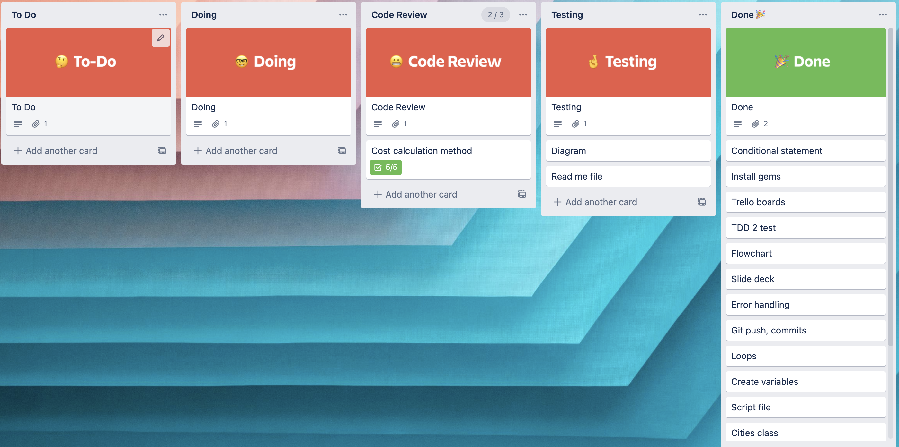

# Roadtrip_Planner v1.0

by Dung Duc Nguyen(Johnny)

# Link to Github repo

https://github.com/Johnny-coderacademy/Roadtrip-planner

# Software development Plan

## Purpose & Scope
This app allows anyone wanting a roadtrip to plan ahead and receive some information about their trip. There are a number of destination and vehicle options to choose. Also, a fuel calculator could assist users to calculate their fuel cost for their trip.

## What prolems can Roadtrip_Planner solve
This app solve the problem of planning and allows users to prepare better for their road trips in term of cost and travel destinations.

## Targer Audience
1. Road users
People who use the road often could select their own road, choose the suitable vehicle to maximize saving on their fuel cost.
2. Travellers
Those who do not know about their destination could use this app to read the description of each city provided with distance and fuel cost estimation.
3. Anyone who do not have road trip experience
This app is useful for beginners since they could estimate how far they have to travel and decide on their route and budget. 
## Features
1. Allow user to input their name up to 3 times

2. Display travel destinations

3. Display vehicle options & their fuel consumption

4. A calculator to find out the fuel cost of each trip

## User Interaction & Experience
1. Users are welcome with a colorful logo and greeting message using TTY-prompt, Artii and Lolize gems. 

2. Then users are asked to enter their names, if they enter an empty letter three times, the app will automatically use the default name: "Mysterious One" to continue.

3. After that, TTY-prompt gem is used to display travel options to users, and they can use "->" in green color to select their options. All questions are in white text while selected input will be print out in light blue coloured text.

4. Next, Users are asked to choose their vehicle options either a car or a motorbike. Once they select their vehicle, the programm will display the fuel consumption for every 100km distance. 

5. Follows the vehicle options, there is a "Want to know more questions" using TTY-prompt gem. This is just future funcitons to add more detail on users' trip but if they say "no", the programs will be exited. If they say "yes" a TTY-progress bar will appear and a sorry message to display.

6. After users have selected their vehicle and travel options, they can use a calculator to find out how much money they need to spend on fuel. While calculating, a progress bar display.

7. Finally, an Exit option located at the bottom will allow users to quit the program once they finish their trip selection.
## Flow Chart
1. Initial Flow Chart

2. Revised Flow Chart

## Diagrams

## Trello board link
https://trello.com/b/XmBwHiH6/terminal-app

## Implementation Plan
Day 1: Start with a health check app, but this was not a good idea so I started again.

Day 2: Start with Roadtrip_Planner idea and approved by educator.

Day 3: Mapping features and decided on design

Day 4: Start coding and trying complicated codes

Day 5: Decide to remove some intial ideas to make the app simple

Day 6: Prepare for demo presentation & tests

Day 7: Bug fixing, cleaning codes

Day 8: Final check up before submitting

# Help Documentation

1. Ruby is to be installed on your computer. [Download ruby here](https://www.ruby-lang.org/en/).

2. Next, Bundler gem installation. Use the following command: 
`gem install bundler`
3. Clone this repository down to your local computer
4. To install the gem(s) required, navigate to the location of the `/src` folder in repostitory on your computer, and use the command:
`bunle add + gem names`

    Here is the list of gems used for this app:

        gem "artii", "~> 2.1"

        gem "lolize", "~> 0.0.3"

        gem "tty", "~> 0.7.0"

        gem "colorize", "~> 0.8.1"

        gem "rspec", "~> 3.10"   

5. locate the path to src folder by :
`cd src`
Run the app with:
`ruby main.rb`
or using script file: run_app.sh by typing the command: 
`./run_app.sh`

# Mininum system requirements
+ CPU 1.6 GHz or faster processor
+ Ram 1 GB of RAM
+ OS X Yosemite (10.10+)
+ Windows 7 (with .NET Framework 4.5.2), 8.0, 8.1 and 10 + (32-bit and 64-bit)
+ Linux (Debian): Ubuntu Desktop 16.04, Debian 9
+ Linux (Red Hat): Red Hat Enterprise Linux 7, CentOS 8, Fedora 24
